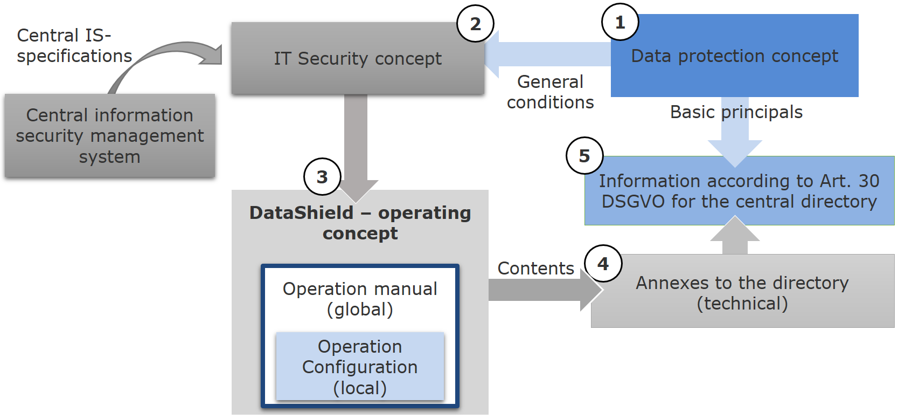

# DataSHIELD Installation

There are still some aspects missing and questions to be clarified. They have been collected in this [document](open-aspects.md).

## 1 Organizational Requirements and Documentations

### 1.1 Privacy Documentation, DSFA, et al.
Each information processing system used at the hospital requires a concept w.r.t. data privacy and security but also operational procedures.
Figure 1 provides an overview about the overall documentation that is needed at each participating location. It consists of multiple documents including the data protection concept, 
the IT security concept, and the operating concept. The first (1, numbered within the figure) describes the requirements and basic principles of DataSHIELD and its use at the location.
Therefore, its general conditions are the basis for the IT security concept (2) which again has a strong impact on the operating concept (3). This concept consists of two parts, a global and a local part.
The global part, the so-called operation manual, is generic in way that it can be reused by other sites. Hence, it is general enough and discussed with all partners within the MII.
The local part conversely maps the global manual to the local set up and, hence, describes the local configuration. Basic principles from the data protection concept are used to create
the entry for central procedure directory (5, ref. Art. 30 GDPR) for which the operating concept is an annex. 



Figure 1: Shared Documentation Concept (provided by Carolin Schmidt, LMU, DIFUTURE)

There are templates available for all documents sketched in the paragraph above. In particular, there is a documents representing the operation manual (global part) of the operating concept. 
All documents are available on the TMF Sharepoint. You need specific credentials to access these documents. In case you already have access, you will find these documents 
following the internal menu path (see menu on the left hand side at the TMF Sharepoint user interface) Taskforces / TF Verteilte Analysen / 05_HandreichungDataSHIELD 

### 1.2 Non-Disclosure Control
tba

## 2 Technical Requirements and Installation
The MII supports a chat for DataSHIELD: https://mii.zulipchat.com/#narrow/stream/313115-DataSHIELD

Official documentation: https://opaldoc.obiba.org/en/dev/admin/installation.html

### 2.1 Overview
Figure 2 shows the typical network architecture when DataSHIELD is used. It spans over three networks. 
1) The clinical network consists of information systems producing and let capture patient data. Data at this level is the source and need to be transferred to the next network.
2) The MEDIC-network contains all storages and information systems integrating clinical data at the DIC. This network contains the DataSHIELD installation.
3) Part of the DMZ-network is a reverse proxy that is connected to the DataSHIELD installation. A whitelist allows very specifically the access on an IP address basis.

 

Figure 2: High-level Network Architecture (provided by Carolin Schmidt, LMU, DIFUTURE) 

Each network is separated and secured by firewalls.
In the following, we will refer to the second network for the DataSHIELD installation.

### 2.2 Technical Requirements
The [official documentation](https://opaldoc.obiba.org/en/dev/admin/installation.html) recommends to set up the virtual or physical machine as follows.

| Component | Recommendation |
|-----------|----------------|
| CPU | Higher server-grade or high-end consumer-grade processor |
| HDD | 8 GB or more |
| RAM | Min. 4GB, recommended > 8GB |

### 2.3 DataSHIELD Installation
There are different ways to install DataSHIELD components. First, you can manually install the infrastructure component by component. 
Second, there are RPM package available. Third and the best choice is (my view) to use Docker Images. Each component is represented by 
a single image for which a container is then created. The simplest way to stick and run them together, is to use [Docker-Compose](https://docs.docker.com/compose/install/). 

At the Leipzig University, we have used Docker to install, configure, and thus make the required components available. The Docker images are described with Docker compose files to manage the environments and interactions across different Docker containers. Moreover, we used two Docker compose scripts. The first is to setup the whole DataSHIELD infrastructure, whereas the second is for configuring a reverse proxy. Since the reverse proxy can be used and configured for different services at once. In this way, you need to install the Docker framework first, before you can make the DataSHIELD components available. 

The following script establishes the components to run DataSHIELD. All services communicate for security reasons in an internal (Docker) network. 

We created a directory called "opal", which contains one file named with "compose.yml" with the following content. Please make sure you change the password adequately.
```bash
services:
  opal:
    image: obiba/opal:latest
    networks:
      - ds-net
    links:
      - rock
      - mongo
      - mysqldata
    environment:
      - JAVA_OPTS=-Xms1G -Xmx8G -XX:+UseG1GC
      - OPAL_ADMINISTRATOR_PASSWORD=password
      - MONGO_HOST=mongo
      - MONGO_PORT=27017
      - MYSQLDATA_HOST=mysqldata
      - MYSQLDATA_USER=opal
      - MYSQLDATA_PASSWORD=password
      - ROCK_HOSTS=rock:8085
    volumes:
      - /tmp/opal:/srv
  mongo:
    image: mongo:4.2
    networks:
      - ds-net
  mysqldata:
    image: mysql:5
    networks:
      - ds-net
    environment:
      - MYSQL_DATABASE=opal
      - MYSQL_ROOT_PASSWORD=password
      - MYSQL_USER=opal
      - MYSQL_PASSWORD=password
  rock:
    image: datashield/rock-base:6.2-R4.2
    networks:
      - ds-net

networks:
  ds-net:
    external: false
    name: ds-net
```

The use of a reverse proxy is required since DataSHIELD doesn't allow to unsecurely connect any client using the API, i.e., over http instead https. We use Caddy as reverse proxy. Of course, there are different products available and you can use one of your choice.
Caddy requires a config file called "Caddyfile". We manage this file in a separate directory, e.g., called "caddy".
This file has the following content.
``` bash
localhost {
    reverse_proxy opal:8080
}
```
Instead of "localhost" you can use a specific domain (DNS entry). Then, we created a Docker compose file in the same directory called again "compose.yml".
``` bash
services:
  
  caddy:
    image: caddy:2.7.5
    volumes:
      - ./Caddyfile:/etc/caddy/Caddyfile
      - caddy-data:/data
    ports:
      - "80:80"
      - "443:443"
    networks:
      - default
      - ds-net

volumes:
  caddy-data:

networks:
  ds-net:
    external: true
```

Finally, you can start the services.
``` bash
cd opal
docker compose up compose.yml

cd ../caddy
docker compose up compose.yml
```

Note, this configuration does not contain any certificates. 

You can follow the official [installation guide](https://opaldoc.obiba.org/en/latest/admin/installation.html#docker-image-installation) and set login and password for administrator role accordingly. 