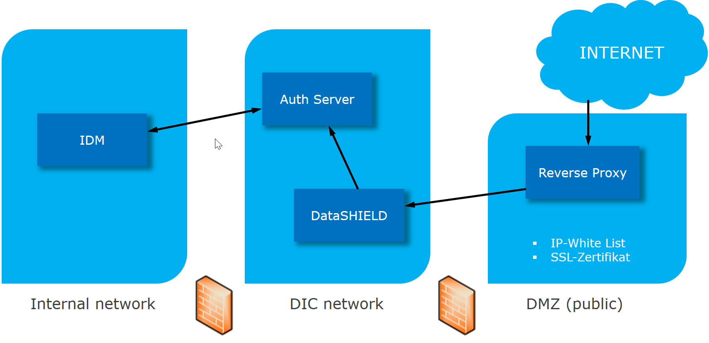

# DataSHIELD Installation

There are still some aspects missing and questions to be clarified. They have been collected in this [document](open-aspects.md).

## 1 Organizational Requirements and Documentations

### 1.1 Privacy Documentation, DSFA, et al.
Each information processing system used at the hospital requires a concept w.r.t. data privacy and security but also operational procedures.
The concept consists of a **global part** that is generic in a way that it can be used in nearly every hospital, and a **local part** that takes all specifics of the current site.

**_It would be good to leave the slide of Mrs Schmidt here._**

There are documents representing the global part of the overall concept which are available within the TMF Sharepoint. 
You need to have specific credentials to access these documents. In case you already have access, you will find these documents 
following the internal menu path (see menu on the left hand side at the TMF Sharepoint user interface) Taskforces / TF Verteilte Analysen / 05_HandreichungDataSHIELD 

### 1.2 Non-Disclosure Control
tba

## 2 Technical Requirements and Installation
The MII supports a chat for DataSHIELD: https://mii.zulipchat.com/#narrow/stream/313115-DataSHIELD

Official documentation: https://opaldoc.obiba.org/en/dev/admin/installation.html

### 2.1 Overview
The architecture spans over three networks. 
1) The clinical network consists of information systems producing and let capture patient data. Data at this level is the source and need to be transferred to the next network.
2) The MEDIC-network contains all storages and information systems integrating clinical data at the DIC. This network contains the DataSHIELD installation.
3) Part of the DMZ-network is a reverse proxy that is connected to the DataSHIELD installation. A whitelist allows very specifically the access on an IP address basis.

 

Each network is separated and secured by firewalls.
In the following, we will refer to the second network for the DataSHIELD installation.

### 2.2 Technical Requirements
The [official documentation](https://opaldoc.obiba.org/en/dev/admin/installation.html) recommends to set up the virtual or physical machine as follows.

| Component | Recommendation |
|-----------|----------------|
| CPU | Higher server-grade or high-end consumer-grade processor |
| HDD | 8 GB or more |
| RAM | Min. 4GB, recommended > 8GB |

### 2.3 DataSHIELD Installation
There are different ways to install DataSHIELD components. First, you can manually install the infrastructure component by component. 
Second, there are RPM package available. Third and the best choice is (my view) to use Docker Images. Each component is represented by 
a single image for which a container is then created. The simplest way to stick and run them together, is to use [Docker-Compose](https://docs.docker.com/compose/install/). 

At the Leipzig University, we have used the following bash script to set up all components. Install the Docker framework first. Then create the following script named by "foo-bar".
```bash
version: '3'
services:
  opal:
    image: obiba/opal:latest
    ports:
      - "8843:8443"
      - "8880:8080"
    links:
      - rock
      - mongo
      - mysqldata
    environment:
      - JAVA_OPTS=-Xms1G -Xmx8G -XX:+UseG1GC
      - OPAL_ADMINISTRATOR_PASSWORD=password
      - MONGO_HOST=mongo
      - MONGO_PORT=27017
      - MYSQLDATA_HOST=mysqldata
      - MYSQLDATA_USER=opal
      - MYSQLDATA_PASSWORD=password
      - ROCK_HOSTS=rock:8085
    volumes:
      - /tmp/opal:/srv
  mongo:
    image: mongo:4.2
  mysqldata:
    image: mysql:5
    environment:
      - MYSQL_DATABASE=opal
      - MYSQL_ROOT_PASSWORD=password
      - MYSQL_USER=opal
      - MYSQL_PASSWORD=password
  rock:
    image: datashield/rock-base:6.2-R4.2
```

You can follow the official [installation guide](https://opaldoc.obiba.org/en/latest/admin/installation.html#docker-image-installation) and set login and password for administrator role accordingly. 